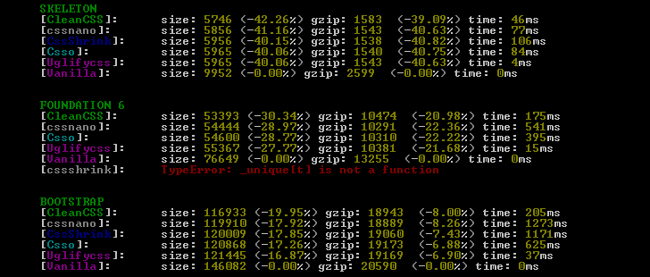

# Benchmark css minifiers
Simple benchmark for CSS minifiers:
* [cssshrink](https://www.npmjs.com/package/cssshrink)
* [clean-css](https://www.npmjs.com/package/clean-css)
* [csso](https://www.npmjs.com/package/csso)

------------------------------------

## Installation
### NPM
```sh
npm install -g cssbench
```

------------------------------------

## Usage
### Command line
```sh
# CSS
cssbench style.css

# SASS
cssbench style.sass
cssbench style.scss

# LESS 
cssbench style.less

# Stylus
cssbench style.styl
```

or with save results

```sh
# CSS
cssbench style.css -s

# SASS
cssbench style.sass -s
cssbench style.scss -s

# LESS 
cssbench style.less -s

# Stylus
cssbench style.styl -s

# save to a file =>
# style-cleancss.css    <- cssshrink
# style-cssshrink.css   <- clean-css
# style-csso.css        <- csso
```

------------------------------------

### Results


------------------------------------

## Options
```sh
-s      # Save results in the working directory
```

------------------------------------

## Build form coffee source
### Build project
The source code in the folder **development**. They should be compiled in the **bin** folder

```sh
# With watching
gulp
```

or

```sh
gulp build
```

### Build gulpfile

```sh
coffee -c gulpfile.coffee
```

------------------------------------

## Changelog
### 0.1.0 [ `Stable` ]
* `Add` - first realise